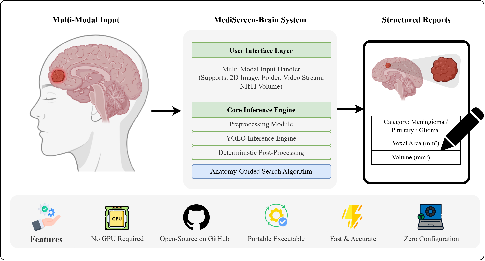

# [MediScreen-Brain](https://jingw-ui.github.io/MediScreen-Brain/)   
## A YOLO-Based, CPU-Optimized GUI Platform for Brain Tumor Detection and Reporting

MediScreen-Brain is a lightweight brain tumor detection system designed for both clinical and research applications. It integrates YOLO object detection models with CPU-specific inference optimization, providing a user-friendly graphical interface (GUI) for non-experts to perform image analysis and generate reports efficiently.

## software download
[MediScreen-Brain.exe](https://github.com/JingW-ui/MediScreen-Brain/releases/tag/MediScreen-Brain)
## source code
```commandline
git clone https://github.com/JingW-ui/MediScreen-Brain.git
```


## Citation
If you use this software in your research, please cite our paper:
> Jing W, et al. (2026). *MediScreen-Brain: A Portable, YOLO-powered GUI for Multi-Modal Brain Tumor Detection, 3D Localization, and Structured Reporting​*. Computer Methods and Programs in Biomedicine. DOI: not published yet

---

## Contact
For questions or collaboration opportunities, please contact:  
📧 202421140108@std.uestc.edu.cn
## my Bio
[JingWang](https://jingw-ui.github.io/)

## License

This project is licensed under the **MIT License**. See the [LICENSE](LICENSE) file for details.
